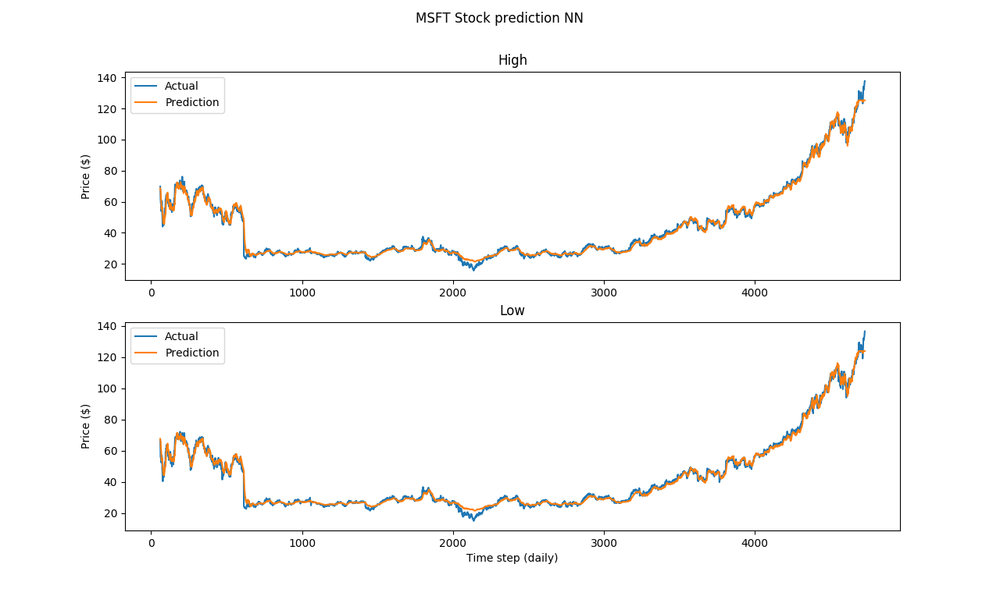

# ReadMe

## Objective
The aim of this project is to forecast multivariate time series stock market data using two different methodes: Standard Neural Network(NN) and Recurrent Neural Network Long Short-Term Memory (LSTM).

## Reading Data from Web
The input files are Gold and MSFT data from year 2000 to 2020. Data are then stored to local csv files. An example of read data from the web and store into csv: 

```
import pandas_datareader.data as webdata
from datetime import datetime 
import os

def read_stock_av_daily(symbol, start, end):
    try:
        df = webdata.DataReader(symbol, "av-daily", start=start, end=end, api_key="GET FREE API")
        df = df.reset_index()
        return df
    except ValueError:
        print("Invalid Input")

start = datetime(2000, 9, 1)
end = datetime(2020, 3, 10)

gld_stock = read_stock_av_daily('GLD', start=start, end=end)
gld_stock.to_csv(r'file path/Gold_Stock.csv', header=True)

```

## Data processing 

Refer to code file Gold_Prediction_NN.py or MSTF_Prediction_NN.py

Data are extracted into dataset using pandas read csv function. Four column prices are extracted as numpy arrays from csv for the multivariate time series problem: ('open', 'low', 'high', 'close'). Another variable called timestep is used for plotting purpose after the training.


```
dataset = pd.read_csv('Gold_Stock.csv')
training = dataset.iloc[:, 2:6].values
timeset = dataset.iloc[:,0].values
```

Dataset is first scaled and normalized between 0 and 1 with MinMaxScaler module from ScikitLearn.

```
sc = MinMaxScaler(feature_range=(0,1))
training_scaled = sc.fit_transform(training)
```

## Standard Neural Network with Keras

### Feature preparation 

The time series forecasting is first re-framed as a supervised learning problem, by transforming the sequence of data to input (X_set) and output (y_set). The simplest way is to use the current observation (t) to predict the observation at the next time step (t+1). In this project, t starts from 60 timesteps and is reshaped into 1 row for use in X_set input and (t+1) 61st timestep row is used in the first row of y_set output for the one-step prediction that is being learned.

```
n = len(dataset)
lag = 60 
features = 4
feature_len = features * lag
```
Every variable matrix size is initialized with numpy empty array feature. Then, values from dataset are allocated to the matrices with a for loop function.

```
X_set = np.empty([n-feature_len, feature_len])
y_set = np.empty([n-feature_len, features]) 
Timset = np.empty([n-feature_len, 1])

for i in range(0, n-feature_len):
    feature = training_scaled[i:i+lag, :]
    feature_expand = feature.reshape(-1,)
    X_set[i,:]= feature_expand 
    y_set[i,:] = training_scaled[i+lag, :]
    Timset[i,] = timeset[i+lag,]
```
train_test_split function is then used to allocate the percent number of X_train, X_test, y_train, y_test.

Keras API is used to identify the number of neurons,  layers, activation functions, and the optimization method to fit the model and predict the output value.

After prediction, the inverse_transform from MinMaxScaler is used to undo the scaling for visualization purpose. 

## Graphs Neural Network prediction





## LSTM with Keras

Refer to code file Gold_Prediction_LSTM.py or MSTF_Prediction_LSTM.py

### Feature preparation 

LSTM uses the same concept for using the observation (t) to predict the observation at the next time step (t+1). The main difference is in feature preparation. LSTM inputs (X_set) are arrays of 3 dimensions. We can still use the t=60 but do not reshape into 2D feature as it was done for the standard Neural Net.

```
n = len(dataset)
lag = 60 
features = 4
feature_len = features * lag
X_set = np.empty([n-feature_len, lag, features])
y_set = np.empty([n-feature_len, features])
Timset = np.empty([n-feature_len, 1])

# Make dataset X_set and y_set, and timestep,
for i in range(0, n-feature_len):
    feature = training_scaled[i:i+lag, :]
    X_set[i,:,:]= feature
    y_set[i,:] = training_scaled[i+lag, :]
    Timset[i,] = timeset[i+lag,]
```

## Graphs LSTM prediction


